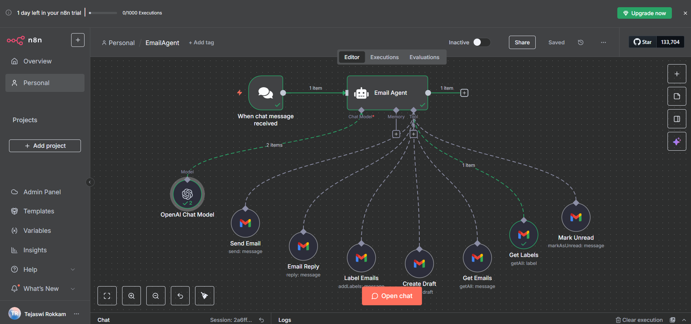

# EmailAgent n8n Workflow

## Overview
This project is an AI-powered email management workflow built using **n8n**, **OpenAI GPT-4.1-mini**, and **Gmail**.  
It allows users to automatically send emails, create drafts, retrieve and reply to emails, label emails, and mark emails as unread—all through chat commands without manual effort.

## Features
- Integrates OpenAI GPT to understand user instructions and generate professional email content in HTML.
- Connects to Gmail to send, draft, reply, label, and manage emails.
- Handles dynamic email fields like recipient address, subject, body, and labels.
- Easy to customize for other email automation tasks.

## Workflow Details
- **Workflow trigger**: Chat message received.
- **AI Node**: Processes chat input and decides which email action to perform.
- **Gmail Nodes**: Execute actions such as sending emails, creating drafts, replying, labeling, and marking unread.

## How to Use
1. Import the `EmailAgent.json` file into your n8n instance.  
2. Configure your **OpenAI API credentials** in the AI node.  
3. Configure your **Gmail OAuth2 credentials** in all Gmail nodes.  
4. Start the workflow and send a chat message to trigger the desired email action.  
5. The workflow will handle email actions automatically.

## Tech Stack
- **n8n** – Workflow automation platform  
- **OpenAI GPT-4.1-mini** – AI for natural language understanding  
- **Gmail API** – Email sending, drafting, and management  

## Demo
Workflow execution can be tested by sending chat commands; emails will be created, sent, or managed automatically based on your instructions.

